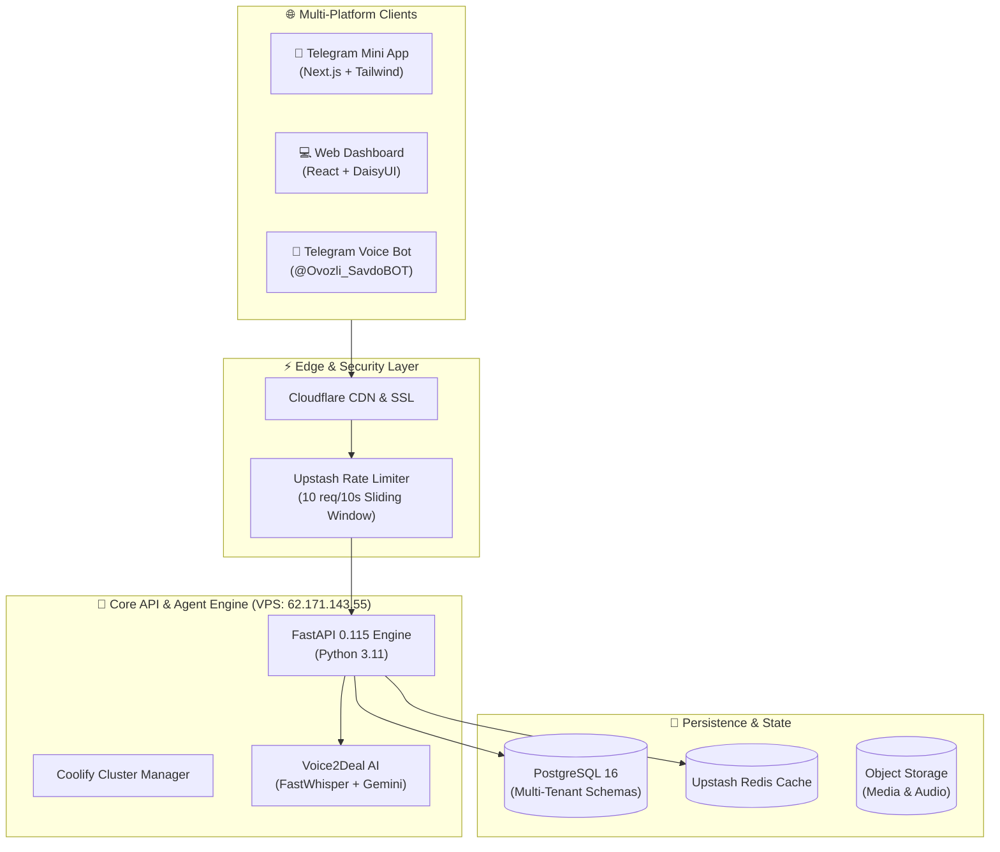

# Excalidraw Diagram Architect 📐🎨

Architectural and visual design engine for generating clean, modern, hand-drawn-style system architecture diagrams and flowcharts.

Designed to turn complex technical architectures into compelling, easy-to-understand visual proposals that close enterprise deals with non-technical founders and CTOs alike.

---

## ⚡ Output Formats Supported

1. **Excalidraw Native JSON (`.excalidraw`)**: Can be opened directly in [excalidraw.com](https://excalidraw.com) or VS Code Excalidraw extension.
2. **Mermaid.js Embeds (`mermaid`)**: Renders instantly in GitHub READMEs, Notion, and Antigravity chat.
3. **Structured ASCII Flow**: Instant terminal and markdown preview.

---

## 💎 High-Conversion Client Architecture Template (Mermaid + Excalidraw)

### 1. High-Level Multi-Tier Cloud Architecture


---

## 🛠️ Programmatic `.excalidraw` Generator (Python Recipe)

Generate an importable `.excalidraw` file with boxes, arrows, and custom typography:

```python
import json

def create_excalidraw_node(id_str, text, x, y, width=200, height=80, bg_color="#e0e7ff"):
    return {
        "id": id_str,
        "type": "rectangle",
        "x": x,
        "y": y,
        "width": width,
        "height": height,
        "angle": 0,
        "strokeColor": "#4338ca",
        "backgroundColor": bg_color,
        "fillStyle": "solid",
        "strokeWidth": 2,
        "strokeStyle": "solid",
        "roughness": 1,
        "opacity": 100,
        "roundness": {"type": 3},
        "seed": 12345,
        "version": 1,
        "isDeleted": False,
        "boundElements": [{"id": f"text_{id_str}", "type": "text"}],
    }

def export_excalidraw_scene(elements, filepath="architecture.excalidraw"):
    scene = {
        "type": "excalidraw",
        "version": 2,
        "source": "https://excalidraw.com",
        "elements": elements,
        "appState": {"viewBackgroundColor": "#ffffff", "gridSize": 20},
        "files": {}
    }
    with open(filepath, "w", encoding="utf-8") as f:
        json.dump(scene, f, indent=2)
```

---

## 🎯 Winning Client Pitches with Visuals
- **Don't just send text proposals**: Include a visual data flow showing how the client's money and leads flow through the software.
- **Color Coding**:
  - 🟢 Green (`#d1fae5`): Revenue, Clients, Payments, Conversions.
  - 🔵 Blue (`#dbeafe`): Core Logic, AI Engine, Automation.
  - 🟣 Purple (`#f3e8ff`): Data Storage, Analytics, Long-term Retention.
