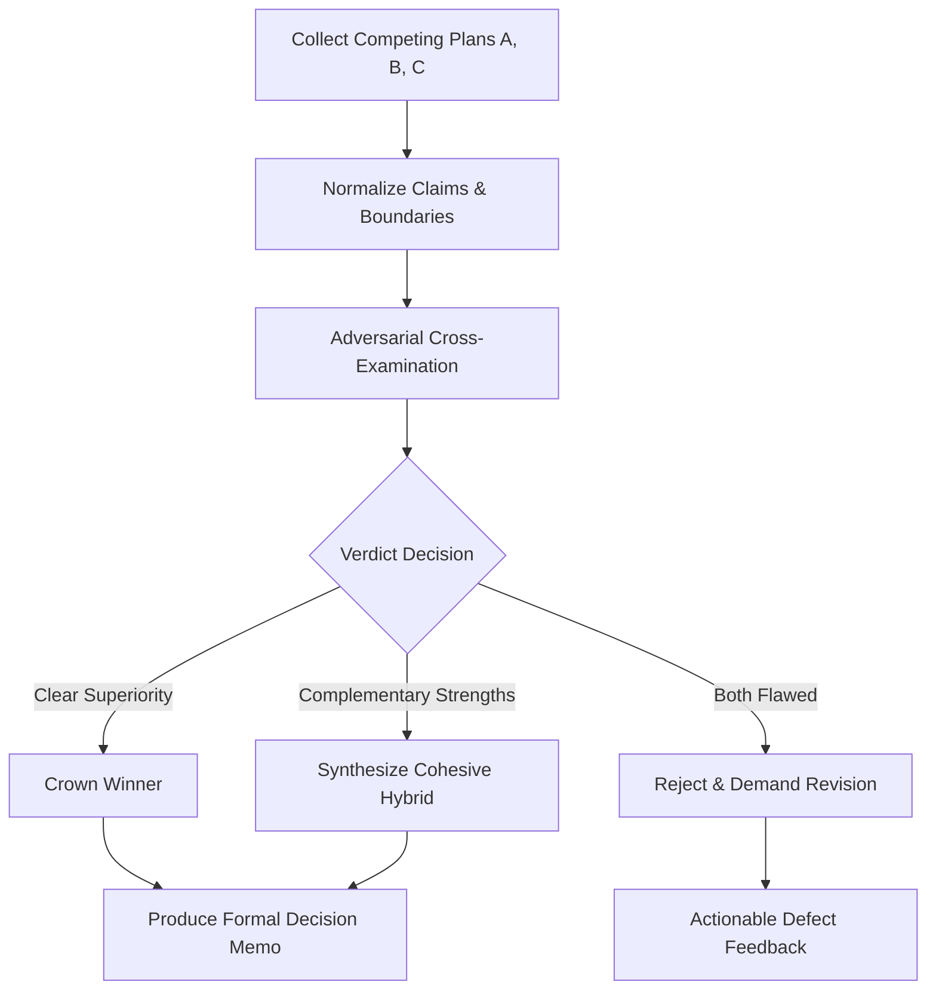

# Plan Arbiter (Multi-Agent Strategy & Plan Conflict Resolution Engine)

Turn competing agent plans into one definitive, verified executable direction. Preserve the best architectural insights, ruthlessly prune weak assumptions or AI slop, and produce an ironclad **Decision Memo** rather than a mediocre blended compromise.

---

## Core Philosophy

1. **No "Blended Mush":** Never combine two mutually incompatible architectures (e.g. half-serverless, half-stateful WebSocket) just to be polite. Choose a clear winner or engineer a deliberate, cohesive hybrid.
2. **Reality-Grounding Over Eloquence:** Disregard stylistic verbosity or confident AI formatting. A 10-line plan grounded in the real file structure and existing codebase beats a 200-line generic textbook monologue every time.
3. **Surgical Tradeoff Accounting:** Every architectural decision trades speed, cost, complexity, or maintainability. Demand explicit identification of what each plan sacrifices.
4. **Adversarial Cross-Examination:** Pitch each plan against the other's strongest critiques. If Plan A overlooks concurrency and Plan B catches it, Plan A cannot win unmodified.

---

## 5-Step Arbitration Workflow



### Step 1: Collect Source Plans
Gather competing proposals from:
- User pasted text / prompt options
- Parallel subagent trajectories (`research`, `self`, `code-reviewer`, `security-auditor`)
- PR descriptions or conflicting GitHub issues
- Transcripts or past sessions

### Step 2: Normalize Plan Claims
Break each candidate plan into standardized dimensions:
- **Objective & Scope:** What exact problem does it solve (and what does it defer)?
- **Grounding & File Impact:** Explicit files modified, added, or deleted.
- **Architectural Assumptions:** Data schemas, state lifecycle, API contracts, third-party libraries.
- **Execution Sequence:** Step ordering, dependency bottlenecks, migration order.
- **Verification Plan:** Unit tests, integration proofs, automated runtime checks.
- **Failure Modes & Blast Radius:** Rollback feasibility, concurrency vulnerabilities, breaking changes.
- **Resource & Token Overhead:** Implementation complexity, cognitive overhead, latency.

### Step 3: Adversarial Cross-Examination
Evaluate candidate plans across Jasper's 5 Quality Gates:
1. **Andrej Karpathy Simplicity Gate:** Is this the absolute minimum clean code required? Does it introduce unnecessary abstractions, extra config layers, or unneeded dependencies?
2. **Edge-Case & Concurrency Gate:** What happens on rapid double-clicks, network timeouts, empty states, or DB lock contention?
3. **Multi-Tenant & Security Isolation:** Does any proposed data flow leak state between tenants or violate `.env` zero-secret leakage rules?
4. **Codebase Fit (Brownfield Reality):** Does the plan respect existing conventions, utilities, and packages already in `package.json` / `requirements.txt`?
5. **Rollback & Verification Proof:** Can every step be verified with a terminal command (`pytest`, `npm test`, `curl`), or does it rely on blind faith?

### Step 4: Formulate the Verdict
Select one of three outcomes:
- **Option A — Crown Solo Winner:** One plan is structurally superior and well-grounded. Adopt it directly with minor tactical patches borrowed from the critique.
- **Option B — Cohesive Hybrid Synthesis:** Plan A has the superior backend/data model, while Plan B has the superior DX/frontend contract. Unify them into a clean single architecture with zero conflicting paradigms.
- **Option C — Reject Both (Demand Revision):** Both plans share fatal blind spots (e.g. misunderstanding the core data source, breaking backwards compatibility, or introducing security risks). Point out exact defects and request targeted revisions.

### Step 5: Generate the Decision Memo

Produce the standardized **Decision Memo** format:

```markdown
# ⚖️ PLAN ARBITER: DECISION MEMO

## 🎯 Context & Challenge
- **Core Directive:** [Brief description of what is being planned]
- **Evaluated Candidates:** [Plan A (Source/Agent), Plan B (Source/Agent)]

---

## 🏆 The Verdict: [WINNER: Plan X / HYBRID: Synthesized Architecture / REJECTED]
[1-2 paragraph executive summary explaining WHY this path wins on merits of simplicity, correctness, and speed.]

---

## 🔬 Comparative Scorecard

| Dimension | Plan A | Plan B | Arbiter Analysis |
| :--- | :--- | :--- | :--- |
| **Codebase Grounding** | High / Med / Low | High / Med / Low | [Specific comparison] |
| **Simplicity & Anti-Slop** | High / Med / Low | High / Med / Low | [Which is leaner?] |
| **Edge-Case Resilience** | High / Med / Low | High / Med / Low | [Locking, error boundaries] |
| **Verification Rigor** | High / Med / Low | High / Med / Low | [Automated test proofs] |
| **Implementation Risk** | Low / Med / High | Low / Med / High | [Blast radius] |

---

## ❌ Rejected Alternatives & Rationale
- **Rejected [Aspect of Plan A]:** [Concrete reason why it was disqualified — e.g. overengineered middleware, memory leak risk]
- **Rejected [Aspect of Plan B]:** [Concrete reason why it was disqualified — e.g. missing rollback, ignores rate-limits]

---

## 🗺️ Unified Execution Blueprint
1. **Phase 1 (Preparation & Types):** [Concrete surgical changes]
2. **Phase 2 (Implementation):** [Core logic flow]
3. **Phase 3 (Verification Gates):** [Exact commands to run]

---

## 🤖 Recommended Subagent Assignment
- **Primary Executor:** `flash` (Speed & syntactic accuracy)
- **Reviewer / Auditor:** `code-reviewer` / `security-auditor`
```

---

## Trigger Phrases
- `/plan-arbiter`
- "Hakamlik qil" / "Rejalarni solishtirib ber"
- "Qaysi plan ma'qul?" / "Arbitrate these plans"
- "Which proposal is better?" / "Merge these competing ideas"
